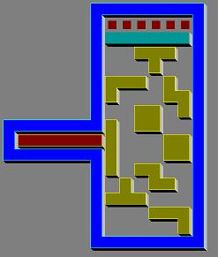



## VB Klotski Game \(aka\) Brick Puzzle Game

### Description

Hi folks! How you all doing?

Several sleepless nights and hard work culminated in this lousy game. This is a simulation of Microsoft(R) Klotski Game written by ZH Computer. By the way, I'm sure someone asked me about this game several months ago (I just don't remember who). Anyway, there are THREE folders in this ZIP file. The first is Level Editor, the rest are both Klotski Game, one with region-outlining and the other with line-outlining technique. You have to play around with Editor to create your own custom level. Okay, enough talking, some of the levels included will definitely leave you scratching your heads! You'd better check it out, LOL.

Comments and suggestions are welcome.
 
### More Info
 

             |
---                |---
**Submitted On**   |2005-02-03 00:35:22
**By**             |[Min Thant Sin](https://github.com/Planet-Source-Code/PSCIndex/blob/master/ByAuthor/min-thant-sin.md)
**Level**          |Beginner
**User Rating**    |5.0 (20 globes from 4 users)
**Compatibility**  |VB 6\.0
**Category**       |[Games](https://github.com/Planet-Source-Code/PSCIndex/blob/master/ByCategory/games__1-38.md)
**World**          |[Visual Basic](https://github.com/Planet-Source-Code/PSCIndex/blob/master/ByWorld/visual-basic.md)
**Archive File**   |[Klotski\_Ga184754222005\.zip](https://github.com/Planet-Source-Code/min-thant-sin-vb-klotski-game-aka-brick-puzzle-game__1-58657/archive/master.zip)

